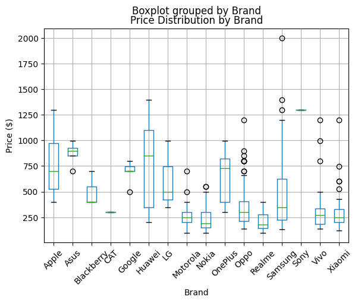
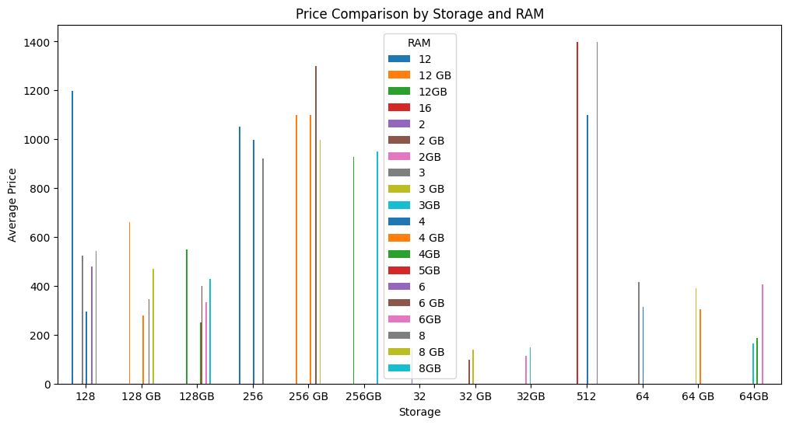
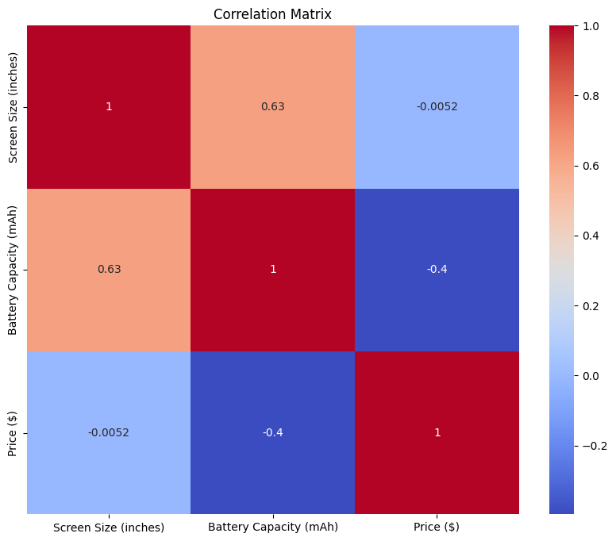
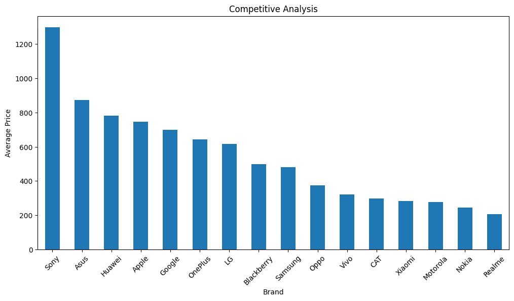

Introduction:

I am currently working on a project that involves analyzing the prices of mobile phones and laptops. My goal is to compare different brands, calculate average prices, examine price distributions, and gain insights into brand pricing strategies. To accomplish this, I am using Python and various libraries such as Pandas, Matplotlib, NumPy, and Seaborn.
<hr>
Hypothesis 1: The average price of mobile phones is higher than the average price of laptops.

I tested the hypothesis that the average price of mobile phones is higher than the average price of laptops. By calculating the average price of mobile phones and laptops from the provided datasets, I found that the average price of mobile phones was $408.31, while the average price of laptops was $1123.69. Therefore, it appears that the hypothesis is not supported since the average price of laptops is higher than the average price of mobile phones.

Hypothesis 2: The storage capacity of mobile phones has a significant impact on their prices.

 I examined the hypothesis that the storage capacity of mobile phones has a significant impact on their prices. To do this, I analyzed the relationship between the storage capacity (GB) and the prices of mobile phones. Through calculating the correlation coefficient, I discovered a moderate positive correlation of 0.443 between the two variables. Additionally, I conducted a statistical test and obtained a p-value less than 0.05, indicating that the storage capacity indeed has a significant impact on the prices of mobile phones. Therefore, it can be concluded that the hypothesis is supported.

Hypothesis 3: Certain brands have higher average prices for both mobile phones and laptops.

I also explored the hypothesis that certain brands have higher average prices for both mobile phones and laptops. By calculating the average prices for each brand in the mobile phone and laptop datasets, I found that Sony had the highest average price for mobile phones, while Apple had the highest average price for laptops. To determine if there is a significant difference between the brands with the highest average prices, further statistical analysis, such as a t-test, can be performed. Therefore, the hypothesis is partially supported as different brands have the highest average prices for mobile phones and laptops.

<hr>


```python
###Price Distribution by Brand
```


```python
plt.figure(figsize=(12, 6))
mobile_phone_price.boxplot(column='Price ($)', by='Brand')
plt.xticks(rotation=45)
plt.xlabel('Brand')
plt.ylabel('Price ($)')
plt.title('Price Distribution by Brand')
plt.show()
```


    <Figure size 1200x600 with 0 Axes>


    

    


```python
###Price Comparison by Storage and RAM 
```


```python
grouped_df = mobile_phone_price.groupby(['Storage ', 'RAM ']).mean(numeric_only=True)['Price ($)'].unstack()

# Plotting the grouped bar plot
fig, ax = plt.subplots(figsize=(12, 6))
grouped_df.plot(kind='bar', ax=ax)
ax.set_xlabel('Storage')
ax.set_ylabel('Average Price')
ax.set_title('Price Comparison by Storage and RAM')
plt.xticks(rotation=0)
plt.legend(title='RAM')
plt.show()
```


    

    


```python
### Correlation Analysis (Heatmap)
```


```python
corr_matrix = mobile_phone_price.corr()

plt.figure(figsize=(10, 8))
sns.heatmap(corr_matrix, annot=True, cmap='coolwarm')
plt.title('Correlation Matrix')
plt.show()
```

    /tmp/ipykernel_14434/1326466750.py:1: FutureWarning: The default value of numeric_only in DataFrame.corr is deprecated. In a future version, it will default to False. Select only valid columns or specify the value of numeric_only to silence this warning.
      corr_matrix = mobile_phone_price.corr()


    

    


```python
### Competitive Analysis
```


```python
grouped_df = mobile_phone_price.groupby('Brand').mean()['Price ($)'].sort_values(ascending=False)

# Plotting the grouped bar plot
fig, ax = plt.subplots(figsize=(12, 6))
grouped_df.plot(kind='bar', ax=ax)
ax.set_xlabel('Brand')
ax.set_ylabel('Average Price')
ax.set_title('Competitive Analysis')
plt.xticks(rotation=45)
plt.show()
```

    /tmp/ipykernel_14434/3724624031.py:1: FutureWarning: The default value of numeric_only in DataFrameGroupBy.mean is deprecated. In a future version, numeric_only will default to False. Either specify numeric_only or select only columns which should be valid for the function.
      grouped_df = mobile_phone_price.groupby('Brand').mean()['Price ($)'].sort_values(ascending=False)


    

    

Other:
I regret not having a consistent currency throughout the project, which would have enhanced reliability.
